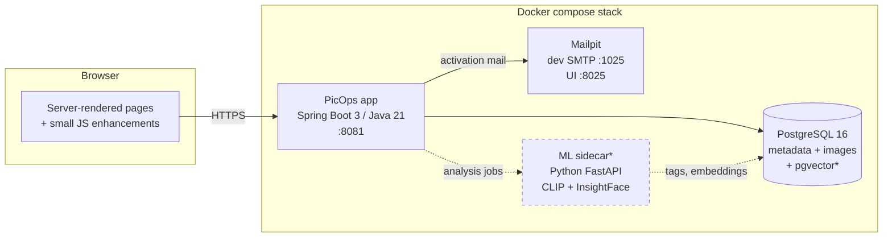
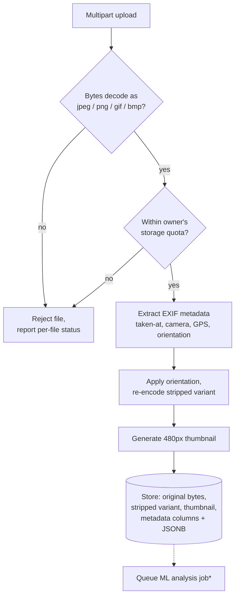
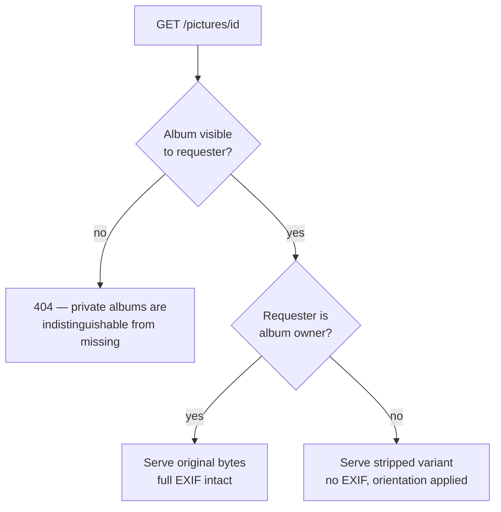
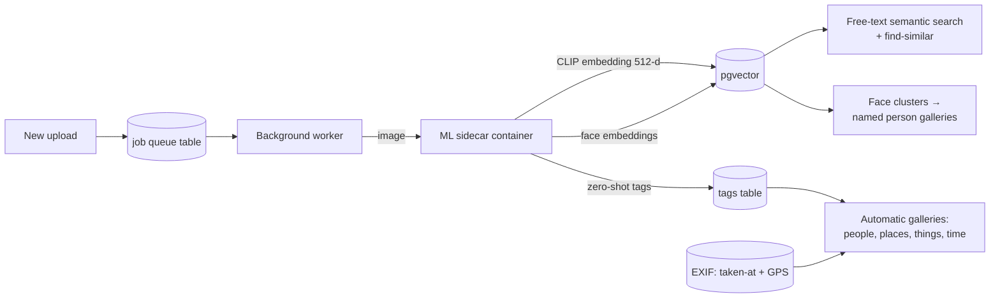

# PicOps v2

Online Photo System — written in 2005 as a JSP/Hibernate/PostgreSQL learning
project, modernized in 2026 to Spring Boot 3 / Java 21 / Thymeleaf while
keeping the original ideas: albums, pictures stored in the database behind
application authorization, quotas, and comments.

- The untouched 2005 application: tag `legacy-2005`
- The 2005 app revived to run in Docker: branch `docker-revival`
- This branch: the modern rewrite, ported one vertical slice at a time

## Run it

```bash
docker compose up -d --build
```

Open http://localhost:8081 and sign in as `testuser` / `picops123`
(seeded by the `dev` profile; port 8080 is where the legacy app usually runs).

## Architecture

### System overview

Solid boxes run today; dashed boxes are the planned ML sidecar stage.



\* planned — see the roadmap below.

All authorization is enforced in the app layer: images are stored in the
database and only ever reach a browser through controllers that check album
visibility and ownership — the original 2005 design thesis, kept.

### Upload pipeline

Every uploaded file passes through this chain before anything is stored.
The content type is determined by sniffing bytes, never by trusting the
client.



### Image serving and the EXIF privacy rule

Originals can contain GPS coordinates and other sensitive EXIF. Only the
album owner ever receives original bytes; everyone else — including viewers
of public albums — gets the metadata-stripped variant.



### Planned ML pipeline (self-hosted, photos never leave the box)



## Stack

Spring Boot 3.3 · Java 21 · Thymeleaf (+ htmx as slices land) · Spring
Security (delegating password encoder, bcrypt today) · Spring Data JPA ·
Flyway migrations · PostgreSQL 16 · GitHub Actions (build + CodeQL)

## Status

- [x] Slice 1 — scaffold, schema baseline, login/logout, seeded dev account, CI
- [x] Slice 2 — albums CRUD + visibility (private albums 404 for non-owners)
- [x] Slice 3 — upload (byte-sniff validation, quota), thumbnails, authorized image serving
- [x] Slice 4 — comments, search, public profile page (/u/username), prev/next photo nav
- [x] Slice 5 — signup with email activation (Mailpit at http://localhost:8025 in dev)
- [x] Slice 6 — drag-and-drop bulk upload with per-file status
- [x] Slice 7 — EXIF metadata extraction, orientation fix, owner-only originals (GPS privacy)
- [x] Slice 8 — ML sidecar: CLIP semantic search, zero-shot tags, find-similar (pgvector)
- [x] Slice 8b — faces (InsightFace), per-owner people clustering, People galleries + naming
- [ ] Slice 9 — Google OAuth (needs client credentials), timeline view, bulk download
- [ ] Slice 10 — storage backend (MinIO/S3) + deployment (home microserver + Azure demo)
